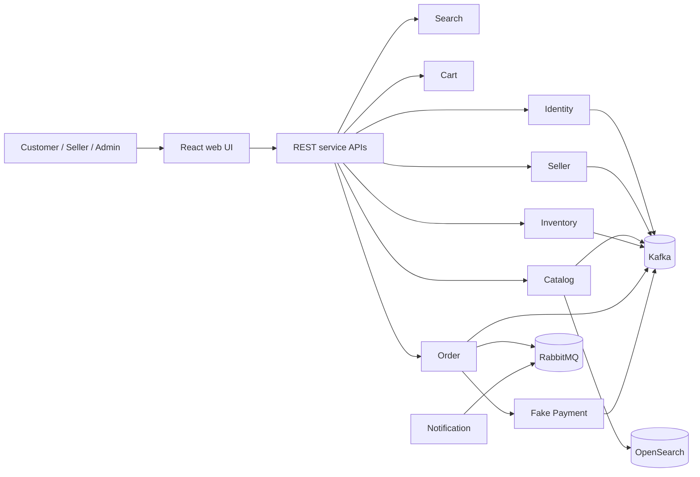
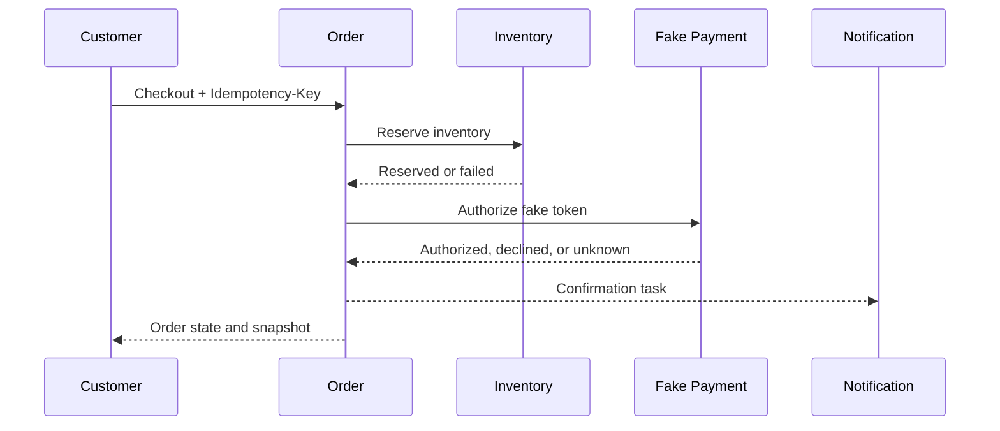

# MarketFlow

## Overview

MarketFlow is a local-first, multi-vendor marketplace portfolio project. Customers browse and buy products, approved sellers manage catalog and fulfillment, and administrators govern seller access and audit history.

The backend remains authoritative for authentication, authorization, prices, inventory, seller state, order state, and payment outcomes. The default deployment is free and local: Docker Compose is the reference runtime and Kubernetes/Helm resources target a local cluster. No paid cloud service, real payment credential, or real email/shipping integration is required.

## Features

- Customer registration, login, carts, checkout, simulated payment, orders, and shipments.
- Seller applications, approval/rejection, suspension, staff permissions, products, inventory, and fulfillment.
- Administrator seller governance and audit-event access.
- Search projections, publication validation, stock reservations, optimistic locking, and negative-stock protection.
- Idempotent checkout, payment callbacks, event consumers, notification retries, and dead-letter workflows.
- Local health checks, metrics, traces, dashboards, backups, restore drills, and recovery runbooks.

## Architecture



See the architecture guide at docs/architecture/README.md for boundaries, data ownership, messaging, the checkout Saga, security, and observability.

## Technology Stack

| Area | Technology |
|---|---|
| Backend | Java 21, Spring Boot, Maven, Spring Security, PostgreSQL |
| Frontend | React, TypeScript, Vite, React Router, TanStack Query, React Hook Form |
| Messaging | Apache Kafka for domain events; RabbitMQ for task-oriented work |
| State/search | Redis carts and rate limits; OpenSearch rebuildable projection |
| Storage | PostgreSQL per service; SeaweedFS local S3-compatible object storage |
| Operations | Docker Compose, Kubernetes, Helm, Prometheus, Grafana, OpenTelemetry, Tempo |
| Testing | JUnit, Testcontainers, contract validation, Vitest, Playwright, local recovery scripts |

## Services

| Service | Responsibility | Primary store |
|---|---|---|
| Identity | Accounts, credentials, sessions, roles, security events | PostgreSQL + Redis |
| Seller | Applications, seller status, memberships, permissions | PostgreSQL |
| Catalog | Products, variants, prices, publication, image metadata | PostgreSQL + object storage |
| Search | Rebuildable product search projection | OpenSearch |
| Inventory | Stock, movements, reservations, expiry | PostgreSQL |
| Cart | Guest/customer carts and advisory prices | Redis |
| Order | Checkout, snapshots, Saga, orders, shipments | PostgreSQL |
| Payment | Fake payment state, attempts, callbacks | PostgreSQL |
| Notification | Templates, delivery attempts, retries, DLQs | PostgreSQL + RabbitMQ |

Services do not query one another's databases or share persistence entities.

## Event-Driven Architecture

Kafka carries durable, versioned domain facts such as product publication, reservations, order state, and payment outcomes. RabbitMQ carries task commands such as notification delivery, where explicit acknowledgement, retry routing, and dead-letter queues are useful. Events use correlation IDs, versioned payloads, and idempotent consumers. See docs/events/README.md.

## Checkout Saga

Order orchestrates checkout across independent stores. It validates current catalog, seller, inventory, and address state, persists an immutable order snapshot, reserves inventory, requests fake payment authorization, and emits confirmation or compensation events.



See docs/architecture/checkout-saga.md.

## Transactional Outbox

Producers persist business state and an outbox event in one local database transaction. A relay publishes committed events afterward. Consumers record processed event IDs with their business effect. Delivery is at-least-once; idempotency makes repeated delivery safe. See docs/adr/ADR-008-outbox-inbox.md and docs/runbooks/outbox-backlog.md.

## Data Ownership

Identity, Seller, Catalog, Inventory, Order, Payment, and Notification each own a separate PostgreSQL database. Cart owns Redis documents; Search owns only its rebuildable OpenSearch projection. Cross-service identifiers are opaque UUIDs and integration uses APIs/events rather than cross-database joins. See docs/architecture/data-ownership.md.

## Security

Passwords are hashed; access tokens are short-lived; refresh tokens rotate and can be revoked. Role and resource-ownership checks are enforced in services, including seller isolation. Only fake opaque payment tokens are accepted. Card numbers, real provider credentials, and secrets are not collected or committed. See docs/security/README.md.

## Observability

Services emit structured logs with correlation IDs, Prometheus metrics, and OpenTelemetry traces. Health/readiness endpoints, dashboards, alert rules, queue/outbox signals, and operational runbooks are included. See docs/architecture/observability.md.

## Testing

The repository includes unit, integration, migration, contract, concurrency, idempotency, Saga, chaos, backup/restore, frontend, and Playwright tests. Verified evidence and environment limits are recorded in docs/release/release-candidate-report.md. No metrics, test counts, latency, throughput, uptime, or security claims are inferred beyond recorded evidence.

## Local Kubernetes

Docker Compose is the reference local runtime. Kubernetes manifests and a Helm chart target Docker Desktop Kubernetes, kind, k3d, or another local cluster using placeholder configuration and out-of-band Secrets. No paid managed service is required. See docs/deployment/local-kubernetes.md.

## Quick Start

Prerequisites: Java 21, Node 22, Docker Desktop with Compose, and PowerShell 7 or a POSIX shell.

`powershell
powershell -NoProfile -ExecutionPolicy Bypass -File .\scripts\bootstrap.ps1
docker compose up -d --wait
.\mvnw.cmd -B clean verify
powershell -NoProfile -ExecutionPolicy Bypass -File .\scripts\validate-contracts.ps1
powershell -NoProfile -ExecutionPolicy Bypass -File .\scripts\smoke-infra.ps1
cd frontend/web
npm ci
npm run dev
```

Open http://localhost:5173. POSIX equivalents are available through make bootstrap, make infra-up, make verify, and make smoke.

## Demo

Seed the verified local checkout fixture:

`powershell
powershell -NoProfile -ExecutionPolicy Bypass -File .\scripts\seed-demo-checkout.ps1
cd frontend/web
npm run test:e2e
```

The fixture uses a published demo laptop, local inventory, a verified demo customer, and fake payment outcomes. It is disposable local data, not a production seed or mock API. See docs/demo/README.md.

## Project Structure

`text
services/       bounded-context implementations
contracts/      OpenAPI, AsyncAPI, event, and message schemas
frontend/web/   React storefront, seller workspace, and admin console
platform/       Compose, Kubernetes, Helm, and observability resources
docs/           architecture, ADRs, APIs, events, security, testing, demos, and runbooks
scripts/        bootstrap, validation, chaos, backup, restore, and fixture commands
```

## Architecture Decisions

Important decisions are recorded in docs/adr: database ownership (ADR-004), Kafka (ADR-005), RabbitMQ (ADR-006), checkout Saga (ADR-007), outbox/inbox (ADR-008), OpenSearch (ADR-010), Redis (ADR-011), token strategy (ADR-012), Kubernetes/Helm (ADR-014), observability (ADR-015), fake payment (ADR-016), money (ADR-018), compatibility (ADR-019), and local Kubernetes (ADR-026).

## Known Limitations

- The default environment is local and single-node; it is not an availability or capacity claim.
- Payment, email, and shipping integrations are simulated/local and do not provide compliance certification.
- Node 22 is the declared frontend toolchain; older Node versions may show engine warnings.
- Kubernetes and Helm validation require those tools and a usable local cluster.
- Development-tool audit findings and local OTLP export warnings are documented in the release report.
- Hosted cloud deployment, real credentials, payment processing, carrier integration, and paid infrastructure are outside scope.

## Documentation Map

- Architecture: docs/architecture/README.md
- API contracts: docs/api/README.md
- Events and messaging: docs/events/README.md
- Security: docs/security/README.md
- Testing: docs/testing/README.md
- Performance evidence: docs/performance/README.md
- Runbooks: docs/runbooks/README.md
- Demo: docs/demo/README.md
- Release evidence: docs/release/README.md

Foundation evidence is recorded in docs/milestones/m0-completion.md.
