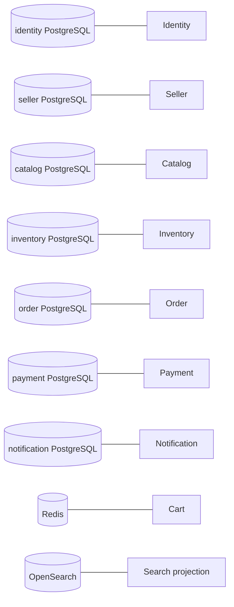

# Data Ownership

## Ownership map

## Rules

- A database is private to its bounded context.
- UUIDs crossing service boundaries are opaque; cross-service foreign keys are not used.
- Catalog is authoritative for product and price data.
- Inventory is authoritative for availability, reservations, and stock movements.
- Order owns immutable commercial/address snapshots and checkout state.
- Payment owns payment state and attempt history.
- Search can be deleted and rebuilt from catalog/seller events.
- Cart estimates are disposable; checkout revalidates current catalog, seller, inventory, and address state.
- PostgreSQL schema changes use migrations and are validated in integration tests.

These rules are recorded in ADR-003 and ADR-004 and are enforced by service boundaries and contracts.
