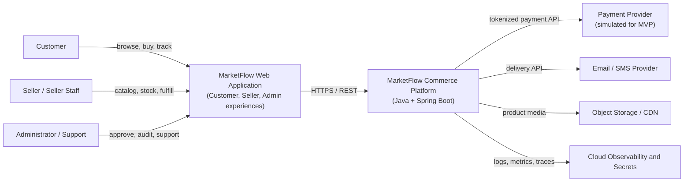
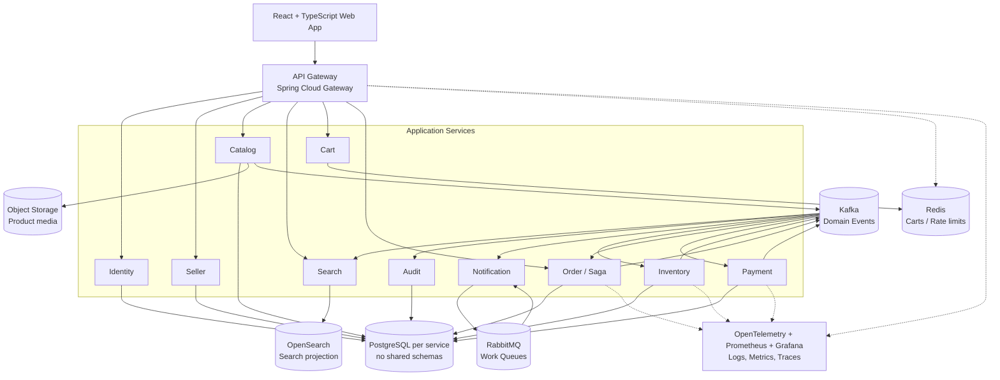
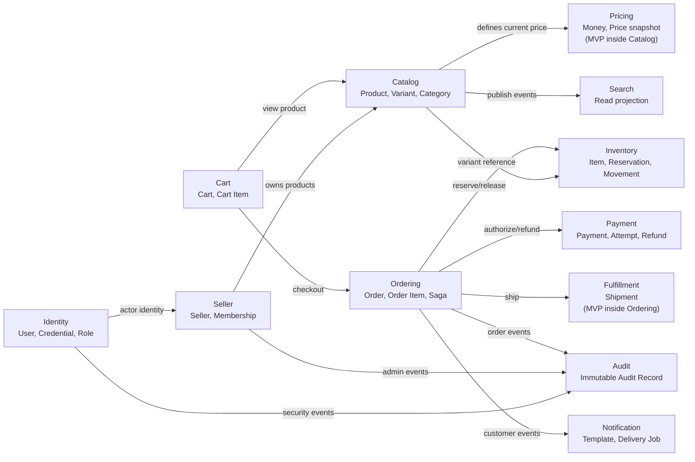
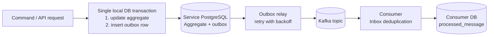
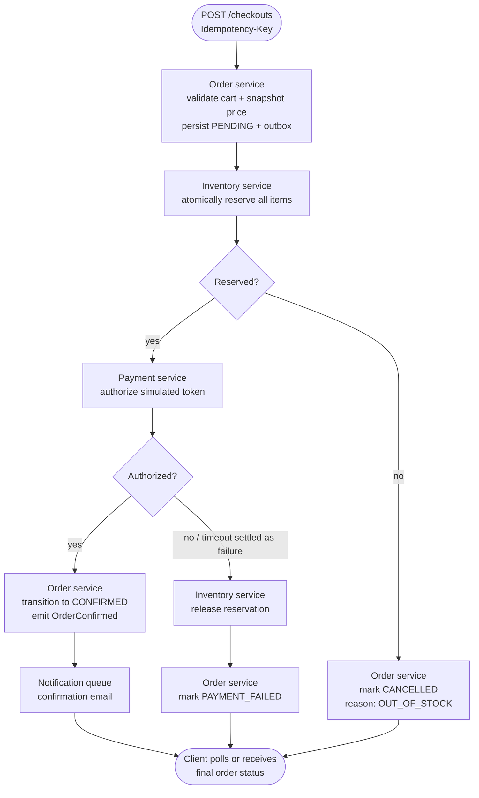
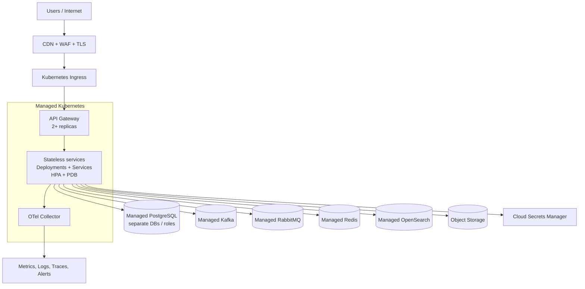
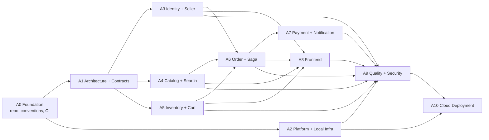

# MARKETFLOW

## Multi-Vendor E-Commerce Platform

**Agent-Ready Product and Engineering Specification**

| **Java + Spring Boot** | **Event-Driven Microservices** | **Docker + Kubernetes** |
| ------------ | ------------ | ------------ |

> **Purpose**
>
> This document is the implementation source of truth for human engineers and coding agents. It defines product scope, architecture, domain boundaries, APIs, events, security, delivery sequence, quality gates, and agent work packages.

*Prepared for Codex-assisted implementation*

*Version 1.0 | 2026-08-03*

## Document Control

| **Field** | **Value** |
| ------------ | ------------ |
| Document | MarketFlow Multi-Vendor E-Commerce Platform - Agent-Ready Product and Engineering Specification |
| Version | 1.0 |
| Status | Approved implementation baseline |
| Audience | Codex agents, software engineers, reviewers, and portfolio evaluators |
| Primary objective | Build a production-style Java platform that demonstrates Spring Boot, REST, SQL, OOP, microservices, CI/CD, cloud architecture, Kafka, RabbitMQ, Docker, Kubernetes, Git, Linux, Agile, and a TypeScript frontend. |
| Change policy | Changes to public APIs, event contracts, security boundaries, or service ownership require an Architecture Decision Record (ADR) and contract review. |

### How to Use This Specification

- **For an orchestrator agent:** create work items from Section 24, enforce dependencies, and require the completion report in Section 25.
- **For an implementation agent:** read the architecture principles, applicable service specification, API and event contracts, and the relevant milestone before changing code.
- **For a reviewer agent:** validate boundaries, security, idempotency, migrations, observability, and tests against the quality gates.
- **For a human owner:** approve ADRs and scope changes; do not permit agents to silently alter contracts or share databases.

> **Source-of-truth hierarchy**
>
> 1) Approved ADRs; 2) OpenAPI, AsyncAPI, and JSON/Avro schemas in the repository; 3) this specification; 4) code. When conflicts are found, stop and create a decision record rather than guessing.

## Table of Contents

- [1. Executive Summary](#1-executive-summary)
- [2. Product Vision, Goals, and Scope](#2-product-vision-goals-and-scope)
- [3. Personas and Core Journeys](#3-personas-and-core-journeys)
- [4. Functional Requirements and User Stories](#4-functional-requirements-and-user-stories)
- [5. Architecture Strategy and Principles](#5-architecture-strategy-and-principles)
- [6. System Context and Target Architecture](#6-system-context-and-target-architecture)
- [7. Domain Model and Bounded Contexts](#7-domain-model-and-bounded-contexts)
- [8. Service Specifications](#8-service-specifications)
- [9. Data Architecture](#9-data-architecture)
- [10. API Design Standards](#10-api-design-standards)
- [11. Event-Driven Architecture and Messaging](#11-event-driven-architecture-and-messaging)
- [12. Core Distributed Workflows](#12-core-distributed-workflows)
- [13. Security and Privacy Architecture](#13-security-and-privacy-architecture)
- [14. Reliability and Resilience](#14-reliability-and-resilience)
- [15. Observability and Operations](#15-observability-and-operations)
- [16. Testing and Quality Strategy](#16-testing-and-quality-strategy)
- [17. Frontend Architecture](#17-frontend-architecture)
- [18. Repository and Developer Experience](#18-repository-and-developer-experience)
- [19. CI/CD and Release Engineering](#19-cicd-and-release-engineering)
- [20. Kubernetes and Cloud Deployment](#20-kubernetes-and-cloud-deployment)
- [21. Delivery Roadmap and Agile Plan](#21-delivery-roadmap-and-agile-plan)
- [22. Prioritized Backlog](#22-prioritized-backlog)
- [23. Architecture Decision Records](#23-architecture-decision-records)
- [24. Agent Workstream Plan](#24-agent-workstream-plan)
- [25. Agent Execution Protocol and Quality Gates](#25-agent-execution-protocol-and-quality-gates)
- [26. Risk Register](#26-risk-register)
- [27. Operational Runbooks](#27-operational-runbooks)
- [28. Final Demonstration and Acceptance](#28-final-demonstration-and-acceptance)
- [Appendix A. API Endpoint Catalog](#appendix-a-api-endpoint-catalog)
- [Appendix B. Event Catalog](#appendix-b-event-catalog)
- [Appendix C. Core Data Model](#appendix-c-core-data-model)
- [Appendix D. Agent Prompt Template](#appendix-d-agent-prompt-template)
- [Appendix E. Glossary](#appendix-e-glossary)

## 1. Executive Summary

MarketFlow is a cloud-native, multi-vendor marketplace designed as a portfolio-grade distributed system rather than a collection of disconnected CRUD applications. Customers browse and buy products; approved sellers manage catalog and inventory; administrators govern the marketplace; asynchronous workflows coordinate inventory, payments, orders, notifications, search indexing, and audit history.

The implementation emphasizes correctness under retries and partial failure. The checkout path uses an orchestrated Saga, transactional outbox publishing, idempotent consumers, optimistic concurrency, immutable order snapshots, and explicit state machines. The platform is containerized, observable, tested with real infrastructure through Testcontainers, and deployable to Kubernetes through a gated CI/CD pipeline.

### 1.1 Recommended technology baseline

| **Area** | **Baseline** |
| ------------ | ------------ |
| Backend | Java 21 LTS, Spring Boot 3.x, Maven, Spring Security, Spring Data JPA/Hibernate |
| Data | PostgreSQL per service, Redis for carts/rate limits, OpenSearch for search projections |
| Messaging | Kafka for durable domain events; RabbitMQ for task-oriented work queues |
| Frontend | React, TypeScript, React Router, TanStack Query, React Hook Form, Zod |
| Platform | Docker, Docker Compose, Kubernetes, Helm, optional Terraform |
| Delivery | GitHub Actions or equivalent, protected main branch, automated scans and tests |
| Observability | OpenTelemetry, Prometheus, Grafana, structured logs, trace backend |
| Testing | JUnit 5, AssertJ, Mockito at boundaries, Testcontainers, contract tests, Playwright, k6 or Gatling |

### 1.2 Target outcome

- A repeatable local environment started with one command.
- A complete customer-to-seller order workflow with payment success and failure compensation.
- Stable REST and event contracts with versioning and compatibility checks.
- Independent service ownership with no cross-service database access.
- Security, observability, migrations, and tests included in every feature definition of done.
- A cloud deployment that demonstrates health probes, horizontal scaling, secrets, ingress, alerts, and rollback.

> **Primary engineering thesis**
>
> A polished system with a small number of well-designed services is more credible than a large service count. The target architecture is microservice-based, but delivery proceeds as thin vertical slices so that the platform remains runnable at every milestone.

## 2. Product Vision, Goals, and Scope

### 2.1 Product vision

Enable independent sellers to publish products and fulfill orders through a reliable marketplace while giving customers a fast, trustworthy shopping experience and administrators clear governance and audit capabilities.

### 2.2 Goals

| **Goal** | **Measure of success** |
| ------------ | ------------ |
| Demonstrate Java and OOP depth | Domain logic is expressed through aggregates, value objects, policies, state transitions, and testable application services. |
| Demonstrate distributed-system design | Checkout remains correct under duplicate requests, duplicate events, timeouts, and consumer restarts. |
| Demonstrate cloud delivery | Images are built, scanned, deployed to Kubernetes, observed, and rolled back automatically when unhealthy. |
| Demonstrate full-stack capability | Customer, seller, and admin workflows are usable through a typed React application. |
| Demonstrate professional engineering | ADRs, diagrams, runbooks, threat model, test evidence, and operational dashboards are part of the repository. |

### 2.3 MVP scope

- Customer registration, login, token refresh, logout, and account status.
- Seller application, administrator approval, seller staff membership, and suspension.
- Product, variant, category, price, image metadata, and publication lifecycle.
- Search, category browsing, filtering, sorting, and product detail pages.
- Inventory adjustments, availability, reservations, expiration, and movement history.
- Guest and authenticated carts, cart merge, quantity updates, and price estimates.
- Checkout, immutable order snapshots, simulated payment authorization, Saga compensation, and order history.
- Seller fulfillment, shipment tracking data, customer cancellation policy, and notifications.
- Administrative audit search and operational health visibility.
- Docker Compose local environment, CI/CD, Kubernetes manifests or Helm charts, and cloud deployment documentation.

### 2.4 Explicit non-goals for MVP

- Storing or processing real card numbers.
- Real seller payouts, financial reconciliation, or tax remittance.
- Multi-region active-active data replication.
- International tax, customs, or complex multi-currency accounting.
- Carrier-specific shipping integrations and warehouse management.
- Production-grade machine-learning recommendations.
- Formal PCI, SOC 2, or other compliance certification claims.

### 2.5 Release strategy

| **Release** | **Outcome** | **Architecture posture** |
| ------------ | ------------ | ------------ |
| R0 - Foundation | Buildable monorepo, contracts, CI, local infrastructure, observability conventions. | No business feature is accepted until the platform baseline is runnable. |
| R1 - Marketplace core | Identity, seller, catalog, inventory, cart, and basic storefront. | Services may initially share a deployment cadence but retain strict code and data boundaries. |
| R2 - Order completion | Checkout Saga, payment simulation, notifications, order history, seller shipment. | Event-driven integration, outbox, inbox deduplication, and failure tests are mandatory. |
| R3 - Cloud hardening | Kubernetes, security hardening, dashboards, load tests, backup/restore, runbooks. | Production-style operations and automated release gates. |
| R4 - Extensions | Reviews, returns, promotions, recommendations, real provider adapters. | Add only after MVP stability and contract maturity. |

## 3. Personas and Core Journeys

| **Persona** | **Primary needs** | **Key permissions** |
| ------------ | ------------ | ------------ |
| Guest | Browse, search, maintain temporary cart, register. | Public catalog and guest-cart operations. |
| Customer | Buy products, manage addresses, track/cancel orders, receive notifications. | Own profile, cart, orders, and payment tokens only. |
| Seller Owner | Manage business profile, staff, products, stock, and fulfillment. | All resources scoped to own seller. |
| Seller Staff | Operate catalog, stock, or fulfillment according to assigned permissions. | Seller-scoped, least-privilege capabilities. |
| Administrator | Approve/suspend sellers, moderate marketplace, view audit history. | Elevated platform governance; all actions audited. |
| Support Agent | Investigate customer and order issues; initiate approved refunds. | Read-heavy access with limited write operations. |
| System Operator | Monitor health, incidents, queues, lag, and deployments. | Operational access, not business-data mutation. |

### 3.1 Golden customer journey

- Browse or search active products.
- Open a product detail page and choose an active variant.
- Add the variant to a guest or authenticated cart.
- Authenticate; merge guest cart when required.
- Enter shipping and billing information and submit checkout with an idempotency key.
- Receive immediate order acknowledgement, then observe final confirmation or failure.
- View order history and shipment status.

### 3.2 Golden seller journey

- Register and submit a seller application.
- Receive approval from an administrator.
- Create a draft product with variants, price, and images.
- Add on-hand inventory and publish the product.
- Receive an order line, fulfill it, and add shipment tracking information.
- Review inventory movements and order status history.

### 3.3 Golden administrator journey

- Review pending seller applications and approve or reject with a reason.
- Suspend a seller and observe catalog effects without corrupting existing orders.
- Search audit records by actor, action, target, correlation ID, and date range.
- Investigate a failed payment or notification using traces and event history.

## 4. Functional Requirements and User Stories

The following stories define the MVP behavior. Each implementation must also satisfy the cross-cutting requirements in security, observability, testing, and data migration sections.

### 4.1 Epic A - Identity and access

**US-A1 - Customer registration**

As a guest, I want to create an account so that I can place orders.

**Acceptance criteria**

- Email is normalized and unique.
- Password policy is enforced and the password is stored using Argon2id or BCrypt.
- Account starts in PENDING_VERIFICATION.
- A verification message is queued without blocking registration.
- Repeated equivalent requests do not create duplicate accounts.
- Security event is written without logging the password or token.

**US-A2 - Secure login**

As a registered user, I want to authenticate securely.

**Acceptance criteria**

- Valid credentials return a short-lived access token and a rotating refresh token.
- Invalid credentials return a generic response.
- Failed attempts are rate-limited and audited.
- Disabled or locked accounts cannot authenticate.
- Refresh-token reuse is detected and the affected token family is revoked.

**US-A3 - Role and ownership enforcement**

As an administrator, I want every protected operation checked by role and resource ownership.

**Acceptance criteria**

- Customers cannot access seller or admin operations.
- Seller users cannot access another seller tenant.
- Service-layer authorization is enforced even when gateway checks are bypassed.
- Denied operations produce a stable error code and audit record.

### 4.2 Epic B - Seller governance

**US-B1 - Seller application**

As a user, I want to apply to sell products.

**Acceptance criteria**

- Required business data is validated.
- The application receives a unique ID and PENDING_REVIEW status.
- Only authorized administrators can approve or reject.
- Status changes include actor, timestamp, and reason.
- The applicant receives a notification.

**US-B2 - Seller staff management**

As a seller owner, I want to invite and manage staff.

**Acceptance criteria**

- Invites are scoped to one seller.
- Only owners grant or revoke staff roles.
- Permission changes are idempotent and audited.
- Removing a member immediately invalidates seller access at the next authorization check.

**US-B3 - Seller suspension**

As an administrator, I want to suspend a seller to protect the marketplace.

**Acceptance criteria**

- New product publication is blocked.
- Active listings become unavailable according to policy.
- Existing orders remain readable and fulfillable according to admin policy.
- A reason is mandatory and all effects are traceable.

### 4.3 Epic C - Catalog and discovery

**US-C1 - Create product and variants**

As an approved seller, I want to create a draft product with sellable variants.

**Acceptance criteria**

- Product starts in DRAFT.
- At least one variant is required before publication.
- Seller SKU is unique within the seller.
- Price uses BigDecimal semantics and an explicit ISO currency code.
- Unknown categories or invalid attributes are rejected.

**US-C2 - Publish product**

As a seller, I want to publish a complete product.

**Acceptance criteria**

- Seller is APPROVED and ACTIVE.
- Required fields, active variant, price, and media checks pass.
- Product transitions only through valid states.
- ProductPublished event is stored in the outbox in the same transaction.
- Search projection becomes discoverable within the target freshness window.

**US-C3 - Search and browse**

As a customer, I want to find products using search, category, filters, and sorting.

**Acceptance criteria**

- Only active products from active sellers are returned.
- Results are paginated and sort fields are allow-listed.
- Facets are returned for supported attributes.
- Search failure does not prevent direct product detail retrieval.
- No internal seller data is exposed.

**US-C4 - Upload product media**

As a seller, I want to add product images.

**Acceptance criteria**

- The backend issues short-lived upload authorization or accepts bounded multipart uploads.
- Content type, size, extension, and image dimensions are validated.
- Object keys are unguessable and tenant-scoped.
- Image metadata includes position and accessible alt text.
- A malware scanning hook is available.

### 4.4 Epic D - Inventory

**US-D1 - Adjust stock**

As a seller, I want to adjust on-hand stock with a reason.

**Acceptance criteria**

- Stock cannot become negative.
- Every adjustment creates an immutable movement record.
- Concurrent changes do not silently overwrite each other.
- Seller ownership is enforced.
- InventoryChanged event is published through the outbox.

**US-D2 - Reserve stock**

As the order workflow, I want stock reserved atomically for checkout.

**Acceptance criteria**

- Reservation succeeds only when available quantity is sufficient.
- One idempotency key cannot reserve twice.
- All lines are reserved or the workflow compensates already reserved lines.
- Reservation has an expiration time.
- Failure publishes a specific event with non-sensitive reason.

**US-D3 - Expire or release reservation**

As the platform, I want unused reservations released.

**Acceptance criteria**

- Expired PENDING reservations are released by a safe scheduled job.
- Confirmed reservations are not released.
- Duplicate release commands are harmless.
- Movement history and metrics reflect releases.

### 4.5 Epic E - Cart and checkout

**US-E1 - Manage cart**

As a customer, I want to add, update, remove, and clear cart items.

**Acceptance criteria**

- Variant exists and is active.
- Quantity bounds are enforced.
- Adding the same variant combines quantities.
- Displayed prices are estimates and include a timestamp.
- Cart operations remain tenant/user scoped and expire according to policy.

**US-E2 - Merge guest cart**

As a customer, I want my guest cart preserved after login.

**Acceptance criteria**

- Guest and user carts merge deterministically.
- Duplicate variants are combined up to maximum quantity.
- Unavailable items are retained with a clear invalid status or removed according to documented policy.
- Merge is idempotent.

**US-E3 - Submit checkout**

As a customer, I want to place an order exactly once even if I retry.

**Acceptance criteria**

- Idempotency-Key is required.
- Request body hash is stored; reusing a key with different input is rejected.
- Catalog, seller status, price, and address inputs are revalidated.
- An immutable order snapshot is created.
- The response returns the original order for a true retry.
- Final status is reached asynchronously through the Saga.

### 4.6 Epic F - Order, payment, fulfillment, and notification

**US-F1 - Authorize simulated payment**

As the order workflow, I want a payment authorization outcome.

**Acceptance criteria**

- Payment attempt uses a unique idempotency key.
- Only opaque fake or provider tokens are accepted.
- Configurable outcomes include approve, decline, timeout, delayed response, and duplicate callback.
- Duplicate callbacks do not duplicate state changes.
- Success and failure events are published through the outbox.

**US-F2 - Confirm or compensate order**

As the platform, I want checkout to remain correct when a dependency fails.

**Acceptance criteria**

- Successful inventory and payment lead to CONFIRMED.
- Payment failure releases inventory and marks PAYMENT_FAILED.
- Inventory failure cancels the order without calling payment.
- Unexpected terminal inconsistencies create a manual-review alert.
- Every transition is validated and recorded in status history.

**US-F3 - View order history**

As a customer, I want to view my historical orders.

**Acceptance criteria**

- Only the owning customer can view the order.
- Product names, SKUs, seller, price, tax, discounts, and addresses are snapshots.
- Pagination is stable.
- Internal provider payloads and secrets are never returned.

**US-F4 - Ship seller order lines**

As a seller, I want to mark my order lines as shipped.

**Acceptance criteria**

- Seller can update only owned lines.
- State transitions are valid and idempotent.
- Carrier and tracking fields are validated.
- Shipment event is published and customer notification is queued.
- Multi-seller orders can have independent fulfillment states.

**US-F5 - Send notifications reliably**

As a customer, I want order and shipment notifications.

**Acceptance criteria**

- Notification is queued after the relevant domain event.
- Transient provider failures retry with exponential backoff and jitter.
- Permanent failures enter a dead-letter queue.
- Notification failure never reverses a valid order.
- Delivery status and template version are recorded.

### 4.7 Epic G - Administration and audit

**US-G1 - Search audit history**

As an administrator, I want to search immutable audit events.

**Acceptance criteria**

- Filters include actor, action, target, correlation ID, and date range.
- Sensitive values are redacted.
- Audit data cannot be changed through normal APIs.
- Access to audit history is itself audited.

**US-G2 - Issue approved refund**

As a support agent, I want to refund an eligible payment.

**Acceptance criteria**

- Refund does not exceed captured amount.
- Permission and order eligibility are checked.
- Refund request is idempotent.
- Order and payment views reflect the refund state.
- The operation is audited and emits an event.

## 5. Architecture Strategy and Principles

### 5.1 Evolutionary architecture

The target system consists of independently deployable services, but implementation is staged to reduce integration risk. The repository starts with strong module boundaries and shared platform conventions. Business capabilities are activated as thin vertical slices. Optional services such as pricing, fulfillment, analytics, and recommendations remain modules until independent scale or ownership justifies extraction.

> **Service extraction rule**
>
> Create a new deployable service only when it needs independent scaling, fault isolation, security boundaries, data ownership, or release cadence. Do not extract merely to increase service count.

### 5.2 Architecture principles

| **ID** | **Principle** | **Implementation meaning** |
| ------ | ------------ | ------------ |
| P1 | Business capability ownership | Each service owns a bounded context, its database, its invariants, and its public contracts. |
| P2 | Domain-first design | Domain code remains independent of Spring where practical; frameworks adapt to the domain through ports. |
| P3 | No shared database | Services never read or write another service database or share ORM entities. |
| P4 | Explicit consistency | Local transactions are strongly consistent; cross-service workflows are eventually consistent and observable. |
| P5 | Idempotency by design | All retry-prone commands and event consumers produce the same result when repeated. |
| P6 | Secure by default | Least privilege, ownership checks, validation, secret isolation, and safe logging are part of every change. |
| P7 | Observable by default | Logs, metrics, traces, correlation, and business events are designed before release. |
| P8 | Contract first | OpenAPI and event schemas are reviewed and versioned before dependent agents implement against them. |
| P9 | Automation first | Build, tests, scans, migrations, deployment, and smoke checks are automated. |
| P10 | Reversible delivery | Schema and deployment changes support rollback or safe forward recovery. |

### 5.3 Core patterns

| **Pattern** | **Use in MarketFlow** | **Guardrail** |
| ------------ | ------------ | ------------ |
| Hexagonal architecture | Domain and application logic depend on ports; REST, JPA, Kafka, and provider clients are adapters. | Do not create framework-free layers that only proxy data. |
| Aggregate + repository | Aggregate methods protect invariants and transitions. | One local transaction should normally modify one aggregate. |
| State machine | Order, payment, seller, product, reservation, and notification lifecycles. | Reject invalid transitions with stable error codes. |
| Transactional outbox | Persist state and event atomically, publish later. | Publisher retries; backlog is observable. |
| Inbox deduplication | Record processed event IDs per consumer. | Deduplication and business change occur in one transaction. |
| Orchestrated Saga | Order service coordinates checkout and compensation. | No distributed database transaction. |
| Adapter / anti-corruption layer | Payment and notification provider models are translated at the boundary. | Provider payloads never leak into domain objects. |
| Circuit breaker / bulkhead | Protect external provider calls and isolate resource pools. | Retries are bounded and only for safe operations. |
| CQRS-lite | Search and audit are read projections built from events. | Source-of-truth data remains in owning services. |
| Specification / policy objects | Authorization, product publication, cancellation, and refund eligibility. | Rules are unit-testable and not scattered across controllers. |

### 5.4 Package-by-feature template

```text
com.marketflow.order
|-- api
|   |-- rest
|   |-- request
|   |-- response
|   `-- advice
|-- application
|   |-- command
|   |-- query
|   |-- service
|   `-- port
|-- domain
|   |-- model
|   |-- event
|   |-- policy
|   `-- exception
`-- infrastructure
    |-- persistence
    |-- messaging
    |-- client
    `-- configuration
```

> *Dependency direction: API -> Application -> Domain. Infrastructure implements application or domain ports. The domain module does not import Spring, JPA, Kafka, or HTTP types.*

## 6. System Context and Target Architecture



*Figure 1. MarketFlow system context.*

All human users interact through the web application. The platform integrates with a simulated payment provider, a delivery provider, object storage, and cloud observability/secrets services. External systems are always accessed through adapters with timeouts, retries, and stable internal models.

### 6.1 Target container architecture



*Figure 2. Target application containers and infrastructure dependencies.*

### 6.2 Communication rules

| **Interaction** | **Mechanism** | **Rule** |
| ------------ | ------------ | ------------ |
| Browser to platform | HTTPS REST through API Gateway | No browser calls directly to internal services. |
| Immediate query or validation | Synchronous REST | Strict timeouts, correlation headers, no cascading retries. |
| Domain fact distribution | Kafka | Past-tense immutable events, partitioned by aggregate ID. |
| Task execution | RabbitMQ | One worker processes a work item; retries and DLQ are explicit. |
| Product media | Object storage | Short-lived upload authorization, private bucket, CDN for public variants. |
| Service data | PostgreSQL owned by service | Separate database/schema credentials and migration history. |

### 6.3 Target service inventory

| **Service** | **MVP responsibility** | **Primary store** |
| ------------ | ------------ | ------------ |
| API Gateway | Routing, token validation, coarse authorization, rate limiting, correlation. | Redis for distributed limits; no business database. |
| Identity | Users, credentials, tokens, roles, account state, security events. | PostgreSQL. |
| Seller | Seller profile, application, approval, membership, suspension. | PostgreSQL. |
| Catalog | Product, variant, category, price, image metadata, publication. | PostgreSQL + object storage. |
| Search | Full-text search, filters, facets, autocomplete, category projection. | OpenSearch; event-rebuildable. |
| Inventory | On-hand, reserved, movements, reservations, expiration. | PostgreSQL. |
| Cart | Guest/authenticated carts, merge, estimated totals. | Redis; optional durable event stream. |
| Order | Checkout validation, snapshots, order state, Saga, order history, fulfillment MVP. | PostgreSQL. |
| Payment | Payment attempts, simulated provider adapter, refunds. | PostgreSQL. |
| Notification | Template rendering, provider delivery, retry/DLQ, delivery history. | PostgreSQL + RabbitMQ. |
| Audit | Append-only audit projection and administrative search. | PostgreSQL or OpenSearch projection. |

## 7. Domain Model and Bounded Contexts



*Figure 3. Bounded contexts and directional dependencies.*

### 7.1 Aggregate catalog

| **Context** | **Aggregate roots** | **Important invariants** |
| ------------ | ------------ | ------------ |
| Identity | User, RefreshTokenFamily | Unique normalized email; secure credential; valid account state; token rotation. |
| Seller | Seller, SellerMembership | Only owner manages membership; APPROVED required to publish; suspension reason required. |
| Catalog | Product, Category | Valid lifecycle; SKU uniqueness per seller; explicit currency; complete before publish. |
| Inventory | InventoryItem, Reservation | on_hand >= 0; reserved >= 0; reserved <= on_hand; idempotent reserve/release. |
| Cart | Cart | Quantity bounds; one item per variant; ownership or guest token scope. |
| Ordering | Order | Immutable commercial snapshots; valid state transitions; totals balance. |
| Payment | Payment, Refund | No duplicate authorization; refund <= captured; opaque payment token only. |
| Notification | NotificationJob | Template version fixed; delivery attempts recorded; terminal failure visible. |
| Audit | AuditRecord | Append-only; sensitive fields redacted; immutable actor/action/target/time. |

### 7.2 Value objects

- **Money:** BigDecimal amount plus ISO currency; scale and rounding are centralized.
- **EmailAddress:** normalized, validated, never used as a mutable primary key.
- **AddressSnapshot:** immutable order-time name, lines, city, region, postal code, and country.
- **SKU:** seller-scoped validated identifier.
- **Quantity:** positive integer with explicit per-operation limits.
- **IdempotencyKey:** validated opaque client key associated with an operation and request hash.
- **CorrelationId / EventId:** globally unique identifiers propagated through logs, traces, and events.

### 7.3 State models

| **Aggregate** | **States** | **Terminal or special rules** |
| ------------ | ------------ | ------------ |
| Seller | DRAFT, PENDING_REVIEW, APPROVED, REJECTED, SUSPENDED, CLOSED | SUSPENDED requires reason; CLOSED is terminal. |
| Product | DRAFT, ACTIVE, INACTIVE, ARCHIVED | Only complete draft can activate; ARCHIVED is not customer-visible. |
| Reservation | PENDING, CONFIRMED, RELEASED, EXPIRED | Only PENDING can confirm, release, or expire. |
| Order | PENDING, INVENTORY_RESERVED, PAYMENT_PROCESSING, CONFIRMED, FULFILLING, SHIPPED, DELIVERED, CANCEL_REQUESTED, CANCELLED, PAYMENT_FAILED, REFUNDED, MANUAL_REVIEW | Every transition is validated and recorded. |
| Payment | CREATED, PROCESSING, AUTHORIZED, DECLINED, CAPTURED, REFUND_PENDING, REFUNDED, FAILED, UNKNOWN | UNKNOWN requires reconciliation before retrying authorization. |
| Notification | QUEUED, PROCESSING, DELIVERED, RETRY_SCHEDULED, DEAD_LETTERED | Delivery failure does not change order state. |

## 8. Service Specifications

### 8.1 API Gateway

**Responsibilities**

- Route public and internal endpoints.
- Validate JWT signature, issuer, audience, expiry, and coarse roles.
- Generate or propagate X-Correlation-ID and W3C trace context.
- Apply Redis-backed rate limits and request-size limits.
- Expose no business persistence or orchestration logic.

**Guardrails**

- Spring Cloud Gateway filters remain thin.
- Internal service authentication uses workload identity or signed service credentials.
- Gateway failure must not result in bypass routes.

### 8.2 Identity Service

**Responsibilities**

- Register, verify, authenticate, refresh, logout, disable, and recover accounts.
- Manage roles and publish security events.
- Store password hashes and rotating refresh-token metadata.
- Provide user summary endpoint for authorized internal consumers.

**Guardrails**

- Access token lifetime is short; refresh token is stored in secure, HttpOnly, SameSite cookie for browser clients.
- No password, raw token, or authorization header is logged.
- Email uniqueness is enforced by a database constraint.

### 8.3 Seller Service

**Responsibilities**

- Manage seller applications, approval, profile, staff membership, and status.
- Publish seller status events.
- Evaluate seller-scoped access policies.

**Guardrails**

- Seller IDs are the tenant boundary.
- APPROVED is required for catalog publication.
- Existing orders remain historically valid after suspension.

### 8.4 Catalog Service

**Responsibilities**

- Manage products, variants, categories, current prices, media metadata, and lifecycle.
- Validate publication readiness.
- Emit product and price events for projections.

**Guardrails**

- The catalog database is authoritative for current product data.
- Order history never queries current catalog data to reconstruct past purchases.
- Image bytes live in object storage, not PostgreSQL.

### 8.5 Search Service

**Responsibilities**

- Consume catalog and seller status events.
- Build a denormalized search document.
- Provide full-text search, facets, filters, sort, and autocomplete.
- Support complete index rebuild from source events or catalog export.

**Guardrails**

- Search is eventually consistent and never authoritative.
- Unknown event fields are tolerated.
- Index aliases support zero-downtime reindexing.

### 8.6 Inventory Service

**Responsibilities**

- Track on-hand and reserved quantities.
- Create, confirm, release, and expire reservations.
- Record movement history and publish availability events.

**Guardrails**

- Atomic conditional updates prevent overselling.
- Scheduled expiration uses a lock-safe batch approach.
- Reservation APIs and consumers are idempotent.

### 8.7 Cart Service

**Responsibilities**

- Manage guest and user carts and merge behavior.
- Return estimated totals and item validity.
- Expire abandoned carts.

**Guardrails**

- Cart price is advisory only.
- Redis keys include environment and actor scope.
- Cart unavailability must not break catalog browsing.

### 8.8 Order Service

**Responsibilities**

- Validate checkout, persist order snapshots, orchestrate Saga, expose order history, process cancellations, and manage MVP shipment state.
- Record status history and compensation outcomes.
- Publish order and fulfillment events.

**Guardrails**

- Order is the Saga authority.
- Every external command includes an idempotency key.
- Inconsistent terminal outcomes transition to MANUAL_REVIEW and alert operators.

### 8.9 Payment Service

**Responsibilities**

- Create payment attempts, call the simulated provider adapter, process callbacks, and manage refunds.
- Publish authorization, decline, unknown, and refund events.

**Guardrails**

- Never persist real card data.
- Provider timeout does not automatically imply decline; ambiguous results use UNKNOWN and reconciliation.
- Provider callback signature is validated.

### 8.10 Notification Service

**Responsibilities**

- Consume notification commands, render versioned templates, deliver messages, retry transient failures, and route permanent failures to DLQ.
- Expose delivery status for support.

**Guardrails**

- No order transaction waits for delivery.
- Retries are bounded.
- Template variables are allow-listed and escaped.

### 8.11 Audit Service

**Responsibilities**

- Consume domain and security events and store an append-only projection.
- Provide admin search and correlation views.

**Guardrails**

- PII is minimized or redacted.
- Audit retention is documented.
- Normal application roles cannot mutate audit records.

## 9. Data Architecture

### 9.1 Ownership and persistence rules

- Each service owns its schema/database, credentials, migrations, and backup classification.
- Cross-service references are opaque IDs, not foreign keys.
- A service cannot join or query another service database.
- Read projections are rebuilt from events or controlled exports and are never the write authority.
- All timestamps are UTC. Database columns use timezone-aware types where supported.
- Money uses numeric/decimal columns and BigDecimal. Floating point is prohibited for commercial values.
- Soft deletion is used only when required by audit/history; otherwise use explicit lifecycle states.

### 9.2 Core relational model

| **Service** | **Principal tables** |
| ------------ | ------------ |
| Identity | user_account, credential, refresh_token_family, role_assignment, security_event, outbox_event, processed_message |
| Seller | seller, seller_application, seller_membership, seller_status_history, outbox_event, processed_message |
| Catalog | category, product, product_variant, product_image, price, product_status_history, outbox_event |
| Inventory | inventory_item, inventory_reservation, inventory_reservation_line, inventory_movement, outbox_event, processed_message |
| Order | orders, order_item, order_status_history, shipment, idempotency_record, outbox_event, processed_message |
| Payment | payment, payment_attempt, provider_callback, refund, idempotency_record, outbox_event, processed_message |
| Notification | notification_job, notification_attempt, template_version, processed_message |
| Audit | audit_record, audit_index_checkpoint, processed_message |

### 9.3 Migration policy

- Use Flyway or Liquibase; migrations are immutable once merged to a release branch.
- Apply expand-and-contract changes: add compatible structures, deploy dual-compatible code, backfill, enforce constraints, then remove old structures later.
- Destructive migrations require backup verification, explicit approval, and a rollback/forward-recovery plan.
- Migration validation runs in CI against a clean database and an upgrade fixture.
- Service startup must not run long blocking backfills. Use controlled jobs for large data changes.

### 9.4 Concurrency and consistency

| **Problem** | **Approach** |
| ------------ | ------------ |
| Inventory oversell | Atomic conditional update or row lock with a strict transaction; validate affected row count. |
| Concurrent product editing | Optimistic version column and If-Match/ETag or version field. |
| Duplicate checkout | Idempotency record keyed by customer + operation + idempotency key, with request hash. |
| Duplicate event | processed_message record and business mutation in one local transaction. |
| Lost event after commit | Transactional outbox and relay retry. |
| Out-of-order event | Aggregate version in event; consumer ignores stale version or rebuilds projection. |
| Cross-service transaction | Saga with explicit compensating actions and manual-review path. |

## 10. API Design Standards

### 10.1 External API conventions

- Base path: /api/v1. Internal service endpoints use /internal/v1 and are not internet-routable.
- JSON request and response bodies; ISO 8601 UTC timestamps; UUIDv7 or UUID identifiers.
- Cursor pagination for large or frequently changing collections; page-number pagination is acceptable for small admin lists.
- Use standard HTTP semantics: 200/201/202/204, 400, 401, 403, 404, 409, 412, 422, 429, 500, and 503.
- Use RFC 9457-style problem details with stable application error codes.
- Idempotency-Key is mandatory for checkout, payment, refund, seller approval, and other retry-prone commands.
- X-Correlation-ID and traceparent are accepted and propagated; server generates missing values.
- Optimistic concurrency uses If-Match/ETag or an explicit version field.

### 10.2 Error envelope

```json
{
  "type": "https://marketflow.dev/errors/insufficient-inventory",
  "title": "Insufficient inventory",
  "status": 409,
  "detail": "Only 2 units are currently available.",
  "instance": "/api/v1/checkouts/0192...",
  "code": "INVENTORY_001",
  "correlationId": "7ef401ad-bc78-4688-92f8-960b164be6db",
  "errors": []
}
```

### 10.3 API compatibility rules

- Adding optional response fields is compatible; clients must tolerate unknown fields.
- Removing or renaming fields, changing meaning, or tightening validation is breaking and requires a new API version or migration window.
- OpenAPI lint and breaking-change checks run in CI.
- Generated client types may be used, but domain models must not depend on generated transport types.
- Internal REST calls use service-specific clients with explicit timeout, retry, circuit-breaker, and telemetry configuration.

## 11. Event-Driven Architecture and Messaging

### 11.1 Kafka and RabbitMQ responsibilities

| **Technology** | **Use** | **Examples** |
| ------------ | ------------ | ------------ |
| Kafka | Durable distribution of immutable domain facts to multiple independent consumers. | ProductPublished, InventoryReserved, PaymentAuthorized, OrderConfirmed, SellerSuspended. |
| RabbitMQ | Task-oriented work where one worker performs a command with retry/DLQ. | SendEmail, GenerateInvoice, ExportReport, RetryProviderDelivery. |

### 11.2 Event envelope

```json
{
  "eventId": "01926fd5-2e58-7b59-a33e-74c2a3651fa2",
  "eventType": "order.order-created.v1",
  "aggregateType": "Order",
  "aggregateId": "01926fd5-253d-7301-88b8-1520c41e2539",
  "aggregateVersion": 1,
  "occurredAt": "2026-08-03T23:30:00Z",
  "correlationId": "f4644a9a-9131-42ca-87e3-0d67f695cdb1",
  "causationId": "7f031225-f50f-460f-bd44-a8347223ac12",
  "producer": "order-service",
  "schemaVersion": 1,
  "data": { }
}
```

### 11.3 Event rules

- Domain events use past-tense fact names and are immutable.
- Topic/event naming: domain.entity-event.v1, for example order.order-confirmed.v1.
- Partition key is aggregate ID when per-aggregate ordering matters.
- Events contain only the minimum data consumers need; sensitive data is referenced or redacted.
- Consumers tolerate unknown fields and validate schema version.
- Breaking changes create a new version and a migration plan; do not reinterpret an old event.
- Every consumer is idempotent and tracks consumer name plus event ID.
- Dead-letter topics include failure reason, original topic/partition/offset, and correlation ID without secrets.

### 11.4 Transactional outbox and inbox



*Figure 4. Reliable event publication and idempotent consumption.*

The outbox record and aggregate update commit in one database transaction. A relay publishes to Kafka and marks or deletes the record only after broker acknowledgement. The consumer stores processed_message in the same local transaction as its business side effect. Exactly-once business outcomes are achieved through idempotency, not by assuming exactly-once network delivery.

### 11.5 Retry and dead-letter policy

| **Failure type** | **Policy** |
| ------------ | ------------ |
| Transient network/broker error | Retry with exponential backoff and jitter; cap attempts and elapsed time. |
| Schema or validation error | Do not retry indefinitely; route to DLQ and alert. |
| Dependent business entity not yet visible | Short bounded retry or delayed topic; monitor ordering assumptions. |
| Duplicate event | Acknowledge after deduplication; no second business side effect. |
| Poison message | DLQ with original metadata; provide replay tool after root-cause fix. |

## 12. Core Distributed Workflows

### 12.1 Checkout Saga



*Figure 5. Orchestrated checkout Saga and primary compensation paths.*

#### 12.2 Checkout transaction steps

- Client submits POST /api/v1/checkouts with Idempotency-Key and a cart/version reference.
- Order service validates identity, cart ownership, product/seller status, current price, quantity, and addresses.
- Order service creates a PENDING order snapshot and outbox event in one transaction.
- Inventory consumes OrderCreated (or a reserve command), atomically reserves lines, and emits InventoryReserved or InventoryReservationFailed.
- Order transitions to INVENTORY_RESERVED / PAYMENT_PROCESSING and instructs Payment to authorize.
- Payment emits PaymentAuthorized, PaymentDeclined, or PaymentUnknown.
- Authorized payment confirms the order; a decline releases inventory and marks PAYMENT_FAILED.
- Unknown payment state triggers reconciliation and prevents a blind second charge.
- OrderConfirmed causes notification and audit projections; notification failure does not affect order validity.

### 12.3 Saga compensation matrix

| **Failure or condition** | **Compensation / action** | **Final state** |
| ------------ | ------------ | ------------ |
| Inventory unavailable | Do not call payment; cancel order and return item-level availability. | CANCELLED |
| Payment declined | Release inventory reservation. | PAYMENT_FAILED |
| Payment timeout with known provider rejection | Release inventory after verified decline. | PAYMENT_FAILED |
| Payment timeout with ambiguous provider state | Hold reservation briefly; reconcile provider by idempotency key; alert if unresolved. | PAYMENT_PROCESSING or MANUAL_REVIEW |
| Order confirmation fails after authorization | Retry local confirmation; if persistent, manual review. Never automatically re-authorize. | MANUAL_REVIEW |
| Notification fails | Retry through RabbitMQ; route to DLQ after terminal failure. | Order unchanged |
| Duplicate event/callback | Return previous result after inbox/idempotency lookup. | Order unchanged |

### 12.4 Product publication workflow

- Seller submits publish command with expected product version.
- Catalog validates seller approval, required fields, variant status, current price, category, and media.
- Catalog transitions product to ACTIVE and writes ProductPublished to outbox.
- Search consumes the event and updates the index; audit records the action.
- If search indexing fails, product remains active and direct retrieval works; indexing retries and lag alerts are used.

### 12.5 Cancellation and refund workflow

- Order service evaluates cancellation policy based on order and fulfillment state.
- Before authorization: release reservation and cancel.
- After authorization but before shipment: request void/refund, then release or restock according to fulfillment state.
- After shipment: MVP may reject cancellation and require a future returns workflow.
- Refund state is owned by Payment; Order reflects a projection of payment outcome.
- Ambiguous provider result routes to MANUAL_REVIEW rather than guessing.

### 12.6 Inventory reservation algorithm

```sql
UPDATE inventory_item
SET reserved = reserved + :quantity,
    version = version + 1,
    updated_at = CURRENT_TIMESTAMP
WHERE variant_id = :variantId
  AND on_hand - reserved >= :quantity
  AND version = :expectedVersion;
```

> *Treat an affected-row count of zero as a concurrency or availability conflict. For multi-line orders, reserve in a deterministic order and compensate any earlier reservations if a later line fails, or use a reservation aggregate that updates all lines in one inventory database transaction.*

## 13. Security and Privacy Architecture

### 13.1 Threat model summary

| **Threat** | **Primary controls** |
| ------------ | ------------ |
| Credential theft / account takeover | Strong hashing, token rotation, short-lived access tokens, rate limits, secure cookies, optional MFA later. |
| Broken object-level authorization | Resource ownership policies in service layer, tenant-scoped repository queries, negative tests. |
| Injection | Bean validation, allow-lists, parameterized JPA/native SQL, safe search query construction. |
| Mass assignment | Dedicated request DTOs; explicit mapping; never bind persistence entities directly. |
| Duplicate charge / replay | Idempotency keys, provider idempotency key, callback signature validation, inbox deduplication. |
| Sensitive data leakage | Structured logging redaction, response DTOs, secret scanning, least-privilege access, encryption in transit/at rest. |
| Malicious file upload | Type/size/dimension validation, object isolation, malware scanning hook, no direct execution. |
| Service-to-service spoofing | Private networking, workload identity or mTLS, audience-scoped credentials, network policies. |
| Supply-chain compromise | Pinned dependencies, SBOM, dependency and image scanning, protected CI secrets, signed artifacts where available. |

### 13.2 Authentication design

- Spring Security implements OAuth 2.1 / OpenID Connect-style token semantics.
- JWT access tokens include subject, issuer, audience, expiry, token ID, and coarse roles; keep claims minimal.
- Refresh tokens are opaque, rotated on use, and stored hashed with token-family metadata.
- Browser refresh token uses Secure, HttpOnly, SameSite cookie; CSRF defense applies to cookie-authenticated endpoints.
- Logout revokes the refresh token family. Account disablement invalidates subsequent refresh and is checked for sensitive operations.

### 13.3 Authorization model

| **Layer** | **Responsibility** |
| ------------ | ------------ |
| Gateway | Validate token and broad route role; never make final resource-ownership decisions. |
| Controller/API | Validate transport input and declare required scopes/roles. |
| Application service | Evaluate permission policy and resource ownership before performing use case. |
| Repository | Use seller/customer predicates where practical to prevent accidental cross-tenant fetch. |
| Audit | Record denied and high-risk successful actions with correlation and actor. |

### 13.4 Secrets and data handling

- No secrets in Git, Docker images, sample configuration, logs, or test snapshots.
- Local development uses .env.example plus developer-managed secret values; CI uses encrypted secret storage.
- Kubernetes references a cloud secrets manager or sealed/external secret mechanism.
- PII is minimized. Addresses are retained only as required for order history and support.
- Audit and log payloads redact access tokens, refresh tokens, passwords, payment tokens, and complete addresses.
- Backups are encrypted and access is role-restricted; restoration is tested.

### 13.5 Payment safety

> **Portfolio safety boundary**
>
> The MVP accepts only fake payment tokens and simulated provider responses. It must not accept, store, log, or transmit real card numbers or security codes, and it must not claim PCI compliance.

## 14. Reliability and Resilience

### 14.1 Service objectives

| **Capability** | **Initial objective** | **Notes** |
| ------------ | ------------ | ------------ |
| Product browse/detail | 99.9% availability; p95 < 300 ms | Cache safe reads; direct detail independent of search. |
| Search | 99.5% availability; p95 < 500 ms | Eventual consistency; degraded message on outage. |
| Cart | 99.5% availability; p95 < 300 ms | Redis dependency; catalog remains available. |
| Checkout acknowledgement | 99.5% availability; p95 < 1 s | Returns accepted/pending; final outcome is asynchronous. |
| Checkout completion | Typical < 10 s | Excludes intentionally delayed provider scenarios. |
| Search freshness | 95% of catalog changes visible < 30 s | Measured by event-to-index latency. |
| Notification | Eventual delivery | Retries and DLQ; no effect on order correctness. |

### 14.2 Resilience standards

- Every remote call has connection, read, and overall deadlines.
- Retries are bounded, use backoff/jitter, and are limited to safe or idempotent operations.
- Circuit breakers protect unstable provider calls; bulkheads isolate connection pools and worker queues.
- Readiness checks fail when a service cannot safely serve traffic; liveness checks only detect unrecoverable process health.
- Graceful shutdown stops new traffic, completes bounded in-flight work, and commits/abandons safely.
- Outbox backlog, Kafka lag, queue depth, and DLQ size are alertable.
- Critical services have PodDisruptionBudgets and at least two replicas in production-style environments.

### 14.3 Degraded behavior matrix

| **Dependency failure** | **Expected platform behavior** |
| ------------ | ------------ |
| OpenSearch unavailable | Search returns a clear temporary error; direct product details and seller catalog writes continue. |
| Notification provider unavailable | Order succeeds; jobs retry; DLQ/alert after terminal failure. |
| Kafka unavailable | Local business transaction commits with outbox row; relay publishes after recovery. |
| RabbitMQ unavailable | Notification commands remain pending in database/outbox or are retried after broker recovery. |
| Redis unavailable | Cart and rate-limit features degrade; no loss of order/catalog data; fail closed for security-sensitive rate limits where required. |
| Payment provider timeout | Do not duplicate authorization; use idempotency/reconciliation and UNKNOWN state. |
| Audit consumer unavailable | Kafka retains events; audit projection catches up later; lag alert fires. |

## 15. Observability and Operations

### 15.1 Telemetry standards

| **Signal** | **Required content** |
| ---------- | ------------ |
| Logs | JSON structure; timestamp, level, service, environment, correlationId, traceId, operation, actor ID when allowed, error code. |
| Metrics | Request rate/error/latency, JVM, DB pool, Kafka lag, Rabbit queue depth, outbox backlog, business success/failure ratios. |
| Traces | Browser/gateway/service spans, messaging producer/consumer spans, database and provider spans with safe attributes. |
| Events | State transitions and business outcomes with event ID, aggregate version, correlation, and causation. |

### 15.2 Business and technical metrics

- checkout_started_total, checkout_confirmed_total, checkout_failed_total by reason.
- inventory_reservation_failure_total and inventory_contention_total.
- payment_authorization_total by outcome and provider latency.
- outbox_unpublished_count and oldest_outbox_age_seconds per service.
- kafka_consumer_lag and dead_letter_event_total per consumer.
- notification_delivery_total by channel/outcome and retry count.
- search_projection_lag_seconds and index_error_total.
- authentication_failure_total, token_reuse_detected_total, and authorization_denied_total.

### 15.3 Dashboards

| **Dashboard** | **Minimum panels** |
| ------------ | ------------ |
| Platform overview | Traffic, error rate, p50/p95/p99 latency, pod health, CPU/memory, deployment version. |
| Checkout health | Started/confirmed/failed, completion latency, Saga state distribution, manual-review count. |
| Messaging | Kafka lag, throughput, retry/DLQ, Rabbit queue depth, oldest message, outbox backlog. |
| Dependencies | PostgreSQL pool/latency, Redis latency, OpenSearch errors, provider latency/circuit state. |
| Security | Login failures, lockouts, rate-limit blocks, token reuse, denied admin operations. |

### 15.4 Alert priorities

| **Severity** | **Example triggers** |
| ------------ | ------------ |
| P1 | Potential duplicate charges, confirmed payment with unconfirmed order, broad authentication outage, data corruption. |
| P2 | Checkout error budget burn, sustained inventory failures, growing outbox/DLQ, database saturation. |
| P3 | Search lag, notification backlog, elevated non-critical endpoint latency. |
| P4 | Capacity forecast, minor dependency vulnerability, documentation/runbook drift. |

## 16. Testing and Quality Strategy

### 16.1 Test pyramid and responsibilities

| **Layer** | **What it proves** | **Tools** |
| ------------ | ------------ | ------------ |
| Unit | Domain invariants, value objects, policies, state transitions, calculations, command handlers. | JUnit 5, AssertJ; Mockito only at ports. |
| Slice | Controller validation/security, repository mappings, serialization, consumer handlers. | Spring test slices. |
| Integration | PostgreSQL constraints, migrations, Kafka/Rabbit/Redis/OpenSearch behavior, outbox/inbox. | Testcontainers. |
| Contract | REST provider/consumer and event schema compatibility. | Spring Cloud Contract or Pact; OpenAPI/JSON Schema/Avro checks. |
| End-to-end | Critical user journeys through UI and APIs. | Playwright plus deployed test environment. |
| Performance | Latency, throughput, contention, backpressure, consumer recovery. | k6 or Gatling. |
| Failure/chaos | Timeouts, duplicate messages, restarts, unavailable dependencies, recovery. | Toxiproxy/Testcontainers, controlled pod kills, fault flags. |

### 16.2 Mandatory test scenarios

- Two concurrent customers attempt to buy the final unit; exactly one reservation succeeds.
- Client retries checkout with the same key and body; same order is returned.
- Client reuses checkout key with a different body; request is rejected.
- Payment provider sends duplicate success callback; payment and order transition once.
- Payment times out ambiguously; no blind duplicate charge is attempted.
- Kafka consumer crashes after business update but before acknowledgement; inbox prevents duplicate side effect.
- Outbox publisher fails after database commit; event publishes after recovery.
- Notification provider fails repeatedly; order remains confirmed and job reaches DLQ.
- Seller attempts to read another seller product or order; request is denied and audited.
- Schema migration upgrades a prior fixture and supports rollback/forward recovery policy.

### 16.3 Quality gates

| **Gate** | **Required result** |
| ------------ | ------------ |
| Build and formatting | Maven build succeeds; formatter/checkstyle passes. |
| Static analysis | No new critical/high SpotBugs or equivalent findings. |
| Tests | Unit, integration, contract, and selected E2E pass. |
| Coverage | Meaningful coverage on domain/application logic; no target gaming. |
| Contracts | OpenAPI/event schema lint and compatibility checks pass. |
| Security | Secret, dependency, SAST, and image scans have no unapproved critical/high issue. |
| Migrations | Clean install and upgrade test pass. |
| Observability | New use case includes logs/metrics/traces and stable error codes. |
| Documentation | README, ADR, contracts, and runbook updates are present when applicable. |

## 17. Frontend Architecture

### 17.1 Stack and structure

```text
frontend/web/src
|-- app              # routing, providers, error boundaries
|-- features
|   |-- auth
|   |-- catalog
|   |-- cart
|   |-- checkout
|   |-- orders
|   |-- seller
|   `-- admin
|-- components       # reusable presentational components
|-- api              # generated/typed API client and interceptors
|-- hooks
|-- validation
`-- test
```

- React + TypeScript with route-level code splitting.
- TanStack Query manages server state, caching, retries, and invalidation.
- React Hook Form + Zod handle client form state and validation; server remains authoritative.
- Access tokens are held in memory when feasible; refresh is handled through secure cookie.
- A typed API client consumes OpenAPI contracts and maps stable error codes to user messages.
- Feature folders own components, queries, mutations, and tests for one business capability.

### 17.2 Primary routes

| **Experience** | **Routes** |
| ------------ | ------------ |
| Customer | /, /products, /products/:id, /cart, /checkout, /account/orders, /account/orders/:id |
| Seller | /seller/dashboard, /seller/products, /seller/products/:id, /seller/inventory, /seller/orders |
| Admin | /admin/sellers, /admin/sellers/:id, /admin/audit, /admin/operations |

### 17.3 UX acceptance standards

- Every page has designed loading, empty, error, and permission-denied states.
- Forms preserve input on recoverable errors and focus the first invalid field.
- Checkout clearly distinguishes pending processing from confirmed success.
- Accessibility includes semantic HTML, keyboard navigation, labels, focus management, and WCAG-aligned contrast.
- No sensitive token or provider data appears in browser logs or error screens.
- Playwright covers the golden customer, seller, and admin journeys.

## 18. Repository and Developer Experience

### 18.1 Monorepo layout

```text
marketflow/
|-- services/
|   |-- api-gateway/
|   |-- identity-service/
|   |-- seller-service/
|   |-- catalog-service/
|   |-- search-service/
|   |-- inventory-service/
|   |-- cart-service/
|   |-- order-service/
|   |-- payment-service/
|   |-- notification-service/
|   `-- audit-service/
|-- frontend/web/
|-- contracts/
|   |-- openapi/
|   |-- asyncapi/
|   `-- events/
|-- platform/
|   |-- docker/
|   |-- kubernetes/
|   |-- helm/
|   |-- terraform/
|   `-- observability/
|-- tests/
|   |-- end-to-end/
|   |-- performance/
|   `-- fixtures/
|-- docs/
|   |-- architecture/
|   |-- adr/
|   |-- runbooks/
|   `-- threat-model/
|-- scripts/
|-- .github/workflows/
|-- docker-compose.yml
|-- pom.xml
|-- Makefile
`-- README.md
```

### 18.2 Local development contract

- make bootstrap installs/checks required tooling and copies safe example configuration.
- make infra-up starts PostgreSQL, Kafka, RabbitMQ, Redis, OpenSearch, object-storage emulator, and observability stack.
- make dev starts services with documented profiles or a selected thin slice.
- make test runs unit and integration tests; make verify runs all local quality checks.
- make seed creates deterministic sellers, products, stock, users, and payment scenarios.
- make demo resets and runs the golden success and compensation workflows.
- Linux shell scripts are POSIX-friendly where practical and fail with actionable messages.

### 18.3 Git workflow

- main is protected and releasable.
- Use short-lived branches and small pull requests with linked work items.
- Require at least one review and all automated checks.
- Use conventional commits, for example feat(order): add idempotent checkout.
- Do not mix formatting, refactoring, contract changes, and feature behavior in one large pull request.
- Generated files are clearly marked and regenerated by a reproducible command.

### 18.4 Coding standards

- Constructor injection; immutable dependencies; records for simple transport/value objects where appropriate.
- No field injection, controller business logic, or persistence entity exposure.
- MapStruct or explicit mappers are acceptable; mappings must be testable and avoid silent field copying.
- Exceptions map to stable error codes through centralized advice.
- Use Optional for return semantics, not fields or request parameters.
- Use UTC clock abstraction in domain/application tests.
- Database indexes are justified by queries and verified with execution plans under representative data.

## 19. CI/CD and Release Engineering

```mermaid
flowchart LR
    PR[Pull Request] --> Compile[Compile + format]
    Compile --> Unit[Unit tests]
    Unit --> Scan[Static + security scans]
    Scan --> Integration["Integration tests<br/>Testcontainers"]
    Integration --> Contract[Contract tests]
    Contract --> Image[Build + scan image]
    Image --> Dev[Deploy dev]
    Dev --> Smoke[Smoke + E2E]
    Smoke --> Staging[Deploy staging]
    Staging --> Approval[Approval]
    Approval --> Prod[Canary / rolling prod]
```



*Figure 6. Gated delivery pipeline.*

### 19.1 Pull request pipeline

- Compile and format validation.
- Unit tests and static analysis.
- Secret, dependency, license, and SAST scans.
- Integration tests with Testcontainers.
- OpenAPI, AsyncAPI, event schema, and compatibility checks.
- Container build and vulnerability scan for changed services.
- Ephemeral or shared development deployment followed by smoke and selected E2E tests.

### 19.2 Release pipeline

- Build immutable versioned images once and promote the same digest across environments.
- Generate SBOM and provenance metadata; sign images/artifacts where the chosen platform supports it.
- Apply database expand migrations before compatible application deployment.
- Deploy with rolling or canary strategy and automated readiness/smoke evaluation.
- Rollback application when safe; use forward recovery for irreversible data changes.
- Record release, image digests, migrations, approver, and change summary.

### 19.3 Environment promotion

| **Environment** | **Purpose** | **Gate** |
| ------------ | ------------ | ------------ |
| Local | Fast development and deterministic failure scenarios. | Developer verify command. |
| Development | Integrated services and shared contract testing. | Automatic deployment from main. |
| Staging | Production-like topology, data volume, security, and E2E/performance tests. | Automated tests plus release candidate approval. |
| Production-style demo | Portfolio demonstration and operational proof. | Manual approval, canary/rolling health gate, rollback readiness. |

## 20. Kubernetes and Cloud Deployment



*Figure 7. Production-style cloud deployment topology.*

### 20.1 Kubernetes resource baseline

- Deployment, ClusterIP Service, ServiceAccount, ConfigMap, Secret references, resource requests/limits.
- Readiness, liveness, and startup probes with distinct semantics.
- HorizontalPodAutoscaler only for services with measurable scaling signals.
- PodDisruptionBudget for gateway, order, inventory, payment, and identity.
- NetworkPolicy permitting only required ingress/egress.
- Topology spread or anti-affinity for critical replicas.
- Graceful termination period and preStop behavior aligned with request/message handling.

### 20.2 Managed services recommendation

| **Capability** | **Recommendation** |
| ------------ | ------------ |
| Relational database | Managed PostgreSQL with automated backups, point-in-time recovery, encryption, and separate roles/databases. |
| Kafka | Managed Kafka where budget allows; otherwise a documented operator-based non-production deployment. |
| RabbitMQ | Managed service or operator with durable queues and monitoring. |
| Redis | Managed Redis with TLS and eviction policy appropriate to carts/rate limits. |
| OpenSearch | Managed OpenSearch with private network access and snapshot policy. |
| Object storage | Cloud bucket with private origin, lifecycle policy, and CDN for public media. |
| Secrets | Cloud secrets manager integrated through workload identity. |

### 20.3 Configuration and tenancy

- Configuration is externalized and validated at startup.
- Environment-specific values do not change business behavior without explicit feature flags or policy.
- Feature flags have owners, expiry dates, and safe defaults.
- Seller tenant boundary is enforced in application and database queries, not by trusting request path IDs.
- Service accounts and database roles follow least privilege.

## 21. Delivery Roadmap and Agile Plan

### 21.1 Milestones and exit criteria

| **Milestone** | **Deliverables** | **Exit criteria** |
| ------------ | ------------ | ------------ |
| M0 Foundation | Repo, Maven parent, standards, contracts skeleton, Compose infra, sample service, CI skeleton. | Build is green; local infra starts; health and telemetry visible. |
| M1 Identity + Seller | Registration/login/refresh, roles, seller application/approval, audit events. | Approved seller authenticates; cross-role and cross-tenant tests pass. |
| M2 Catalog + Inventory | Products/variants/media, publication, stock adjustments/reservations, search projection. | Published product is searchable; concurrency test prevents oversell. |
| M3 Cart + Checkout | Guest/user carts, merge, order snapshot, checkout idempotency, Saga foundation. | Duplicate checkout returns same order; reservation occurs once. |
| M4 Payment + Completion | Payment simulator, compensation, order history, manual-review path. | Success confirms; decline releases; ambiguous timeout does not duplicate charge. |
| M5 Fulfillment + Notification | Seller shipment, customer notifications, retries, DLQ. | Notification outage does not affect order correctness. |
| M6 Cloud Deployment | Images, Kubernetes/Helm, ingress/TLS, secrets, dashboards, release pipeline. | Full platform deploys and unhealthy release rolls back. |
| M7 Hardening | Load/chaos/security tests, backup restore, runbooks, polished demo. | Critical path meets objectives; high findings resolved; recovery demonstrated. |

### 21.2 Suggested sprint cadence

Use two-week sprints or equivalent milestone slices. Every sprint must produce a runnable increment, updated contracts, test evidence, and a demo. Architecture and platform work are pulled just ahead of feature implementation, not completed as an unbounded up-front phase.

| **Sprint** | **Primary outcome** |
| ---------- | ------------ |
| 0 | Repository, local stack, CI, coding standards, initial ADRs and contracts. |
| 1 | Identity registration/login and seller application thin slice. |
| 2 | Seller approval, product draft/publish, product detail. |
| 3 | Inventory adjustment/reservation and search projection. |
| 4 | Cart, merge, checkout idempotency, PENDING order. |
| 5 | Payment simulator, Saga success and decline compensation. |
| 6 | Order history, seller shipment, notification retry/DLQ. |
| 7 | Kubernetes deployment, dashboards, alerts, smoke tests. |
| 8 | Performance, chaos, security hardening, backup/restore, final demo. |

### 21.3 Definition of Ready

- Business value and actor are clear.
- Acceptance criteria are testable.
- Dependencies and owner are identified.
- API/event/schema changes are drafted.
- Failure and compensation behavior are specified.
- Security, migration, and observability impacts are stated.

### 21.4 Definition of Done

- Acceptance criteria pass in an integrated environment.
- Unit, integration, contract, and relevant E2E tests pass.
- Authorization and negative-path tests exist.
- Migration and rollback/forward-recovery behavior are validated.
- Logs, metrics, traces, error codes, and dashboards are updated.
- Contracts, ADRs, README, and runbooks are updated.
- No unapproved critical/high security issue remains.
- Feature can be demonstrated from a clean environment.

## 22. Prioritized Backlog

The orchestrator should create one issue per backlog item. Items within a wave may run in parallel only when their contract and platform prerequisites are merged.

| **ID** | **Area** | **Work item** | **Milestone** |
| ------ | ------------ | ------------ | ------------ |
| P0-01 | Foundation | Create Maven parent, shared build conventions, service template, and Make targets. | M0 |
| P0-02 | Contracts | Define problem-details error schema, correlation headers, ID/time/money conventions. | M0 |
| P0-03 | Platform | Compose stack for PostgreSQL, Kafka, RabbitMQ, Redis, OpenSearch, object storage, observability. | M0 |
| P0-04 | CI | PR pipeline with build, unit, lint, secret/dependency scans, and integration stage. | M0 |
| P0-05 | Observability | Structured logging, OTel instrumentation, health endpoints, base dashboards. | M0 |
| P1-01 | Identity | Registration, verification token, secure password hashing, uniqueness. | M1 |
| P1-02 | Identity | Login, access/refresh token rotation, logout, rate limits, security events. | M1 |
| P1-03 | Seller | Seller application, approval/rejection, status history, notifications. | M1 |
| P1-04 | Authorization | Role/ownership policy framework and negative integration tests. | M1 |
| P2-01 | Catalog | Product/variant/category model, draft editing, migrations, APIs. | M2 |
| P2-02 | Media | Safe image upload metadata and object storage adapter. | M2 |
| P2-03 | Publication | Publication policy, state transition, ProductPublished outbox event. | M2 |
| P2-04 | Inventory | Stock adjustment, movement history, optimistic/atomic concurrency. | M2 |
| P2-05 | Reservation | Reserve/release/expire operations, idempotency, contention tests. | M2 |
| P2-06 | Search | Catalog event consumer, index mapping, search/filter/facet endpoints, rebuild. | M2 |
| P3-01 | Cart | Guest/user cart, quantity rules, Redis repository, expiration. | M3 |
| P3-02 | Cart | Login merge behavior and invalid-item handling. | M3 |
| P3-03 | Order | Order aggregate, snapshots, totals, state history, migrations. | M3 |
| P3-04 | Checkout | Idempotent checkout endpoint and OrderCreated outbox event. | M3 |
| P3-05 | Saga | Inventory reservation orchestration and failure compensation. | M3 |
| P4-01 | Payment | Payment aggregate, simulator adapter, configurable outcomes. | M4 |
| P4-02 | Saga | Payment authorization, success confirmation, decline release. | M4 |
| P4-03 | Reliability | Unknown payment reconciliation and manual-review alert. | M4 |
| P4-04 | Order | Customer order history/detail and authorization. | M4 |
| P5-01 | Notification | Rabbit queues, template versioning, retry/DLQ, delivery status. | M5 |
| P5-02 | Fulfillment | Seller order view and shipment state/tracking. | M5 |
| P5-03 | Audit | Audit consumer, immutable storage, admin search. | M5 |
| P5-04 | Frontend | Customer storefront/cart/checkout/orders and seller/admin flows. | M1-M5 |
| P6-01 | Kubernetes | Helm/manifests, probes, resources, HPA/PDB, network policies. | M6 |
| P6-02 | Release | Image scan, registry promotion, staging/prod-style deploy, rollback. | M6 |
| P6-03 | Cloud | Managed service adapters, secrets, ingress/TLS, object storage/CDN. | M6 |
| P7-01 | Quality | Golden E2E, concurrency, duplicate event/callback, chaos scenarios. | M7 |
| P7-02 | Performance | Load profiles, SLO measurement, tuning and capacity notes. | M7 |
| P7-03 | Operations | Runbooks, alerts, backup/restore exercise, final demonstration script. | M7 |

## 23. Architecture Decision Records

ADRs prevent agents from making incompatible local optimizations. Create the following records before or during Milestone 0, and update status when decisions change.

| **ADR** | **Decision** |
| ------- | ------------ |
| ADR-001 | Java 21 and Spring Boot 3.x |
| ADR-002 | Evolutionary service extraction and bounded contexts |
| ADR-003 | PostgreSQL as primary relational database |
| ADR-004 | Database ownership per service |
| ADR-005 | Kafka for domain events |
| ADR-006 | RabbitMQ for task queues |
| ADR-007 | Orchestrated Saga for checkout |
| ADR-008 | Transactional outbox and inbox deduplication |
| ADR-009 | REST and OpenAPI for synchronous contracts |
| ADR-010 | OpenSearch as event-built search projection |
| ADR-011 | Redis for carts and distributed rate limits |
| ADR-012 | JWT access tokens and rotating opaque refresh tokens |
| ADR-013 | Monorepo and Maven parent |
| ADR-014 | Kubernetes/Helm deployment model |
| ADR-015 | OpenTelemetry observability standard |
| ADR-016 | Simulated payment provider in MVP |
| ADR-017 | UUID/UUIDv7 identifiers and UTC time |
| ADR-018 | Money representation and rounding policy |
| ADR-019 | API/event compatibility and versioning |
| ADR-020 | Secrets and workload identity strategy |

### 23.1 ADR template

```markdown
# ADR-NNN: Decision title
Status: Proposed | Accepted | Superseded | Deprecated
Date:
Owners:

## Context
## Decision
## Alternatives considered
## Consequences
## Security implications
## Operational implications
## Migration / rollback
## References
```

## 24. Agent Workstream Plan



*Figure 8. Agent dependency graph. Parallel work begins only after contracts and prerequisites are stable.*

### 24.1 Workstream ownership

| **Agent** | **Owns** | **Required deliverables** |
| ------------ | ------------ | ------------ |
| A0 - Foundation | Repository skeleton, Maven parent, conventions, service template. | Green build; template service; Make targets; CODEOWNERS. |
| A1 - Architecture/Contracts | ADRs, OpenAPI, event schemas, error model, naming/versioning. | Validated contracts and compatibility checks. |
| A2 - Platform | Compose, CI, Testcontainers support, observability, shared dev scripts. | One-command local environment and pipeline. |
| A3 - Identity/Seller | Authentication, tokens, roles, seller application/membership. | Security tests, migrations, APIs/events. |
| A4 - Catalog/Search | Product, variant, media, publication, search projection. | Catalog/search APIs, rebuild, contract tests. |
| A5 - Inventory/Cart | Stock, reservation, expiration, cart/merge. | Concurrency and idempotency evidence. |
| A6 - Order/Saga | Order aggregate, checkout, Saga, history, fulfillment MVP. | Success/failure compensation and state tests. |
| A7 - Payment/Notification | Provider simulator, callbacks/refunds, Rabbit delivery. | Duplicate/timeout tests, retry/DLQ evidence. |
| A8 - Frontend | Customer/seller/admin web experiences. | Typed client, accessibility, Playwright journeys. |
| A9 - Quality/Security | Cross-service E2E, performance, threat model, review gates. | Quality report, vulnerabilities triage, failure tests. |
| A10 - Cloud | Kubernetes/Helm, secrets, managed services, release, dashboards. | Deployable environment, smoke/rollback proof. |

### 24.2 File ownership and collision rules

- One agent owns a service directory during an active work item. Other agents propose changes through an issue or contract pull request.
- A1 owns contracts/ and docs/adr/; dependent agents do not change public schemas without A1 review.
- A2 owns shared build, Compose, CI templates, and observability libraries; service agents contribute via small reviewed changes.
- A8 owns frontend/web; backend agents provide contracts and fixtures rather than editing UI code.
- A9 may add tests across services but avoids refactoring production code without the owning agent.
- Generated code is regenerated from the source contract; agents do not hand-edit generated files.

### 24.3 Agent sequencing

| **Wave** | **Can run in parallel** | **Prerequisites** |
| -------- | ------------ | ------------ |
| Wave 0 | A0, A1, A2 | Project owner approves baseline scope. |
| Wave 1 | A3, A4, A5 | Repo, error/id/time/money conventions, CI, local infra. |
| Wave 2 | A6, A8 (foundation screens) | Identity, catalog, inventory, cart contracts and test fixtures. |
| Wave 3 | A7, A8 (checkout/orders) | Order/Saga contracts and simulator contract. |
| Wave 4 | A9, A10 | Integrated MVP on development environment. |
| Wave 5 | All owners for fixes/polish | Quality report, performance results, threat model, cloud smoke results. |

## 25. Agent Execution Protocol and Quality Gates

### 25.1 Mandatory instructions for every agent

- Read this specification, relevant ADRs, contracts, and service README before editing.
- Restate the scoped work item, prerequisites, and files to be changed.
- Do not change public contracts, service ownership, or security boundaries silently.
- Implement domain behavior before adapters; keep controllers thin.
- Add migrations rather than editing schemas manually.
- Make retry-prone commands and every event consumer idempotent.
- Add success, validation, authorization, concurrency, and failure-path tests.
- Add structured logs, metrics, traces, and stable error codes without sensitive data.
- Run the service verify command and any required cross-service tests.
- Keep the pull request small; document known limitations and follow-up work.

### 25.2 Required completion report

```markdown
## Completion report
Summary:
Work item / issue:
Files changed:
Contracts implemented or changed:
Database migrations:
Domain rules and failure behavior:
Tests added and commands run:
Security considerations:
Observability added:
Compatibility / rollout notes:
Known limitations:
Follow-up work:
Final status: PASS | BLOCKED
```

### 25.3 Reviewer checklist

| **Category** | **Reviewer questions** |
| ------------ | ------------ |
| Boundaries | Does the change remain within the owned bounded context? Any cross-database or shared-entity coupling? |
| Correctness | Are invariants and state transitions enforced in the domain/application layer? |
| Idempotency | What happens on duplicate HTTP request, event, provider callback, or job retry? |
| Failure | Are timeouts, ambiguity, compensation, DLQ, and manual-review paths explicit? |
| Security | Are role and ownership checks present? Any secret/PII in logs or responses? |
| Data | Are migrations compatible, indexed, constrained, and tested? |
| Contracts | Are API/event schemas updated and backward compatible? |
| Observability | Can an operator trace the request and see the business outcome? |
| Tests | Do tests use real infrastructure where behavior depends on it? Are negative paths covered? |
| Operations | Is deployment/rollback safe and is a runbook or alert update needed? |

### 25.4 Stop conditions

> **An agent must stop and request a decision when:**
>
> A required contract is missing or contradictory; a schema change is destructive; payment state is ambiguous; a security boundary is unclear; a service would need another service database; acceptance criteria cannot be tested; or the requested change conflicts with an accepted ADR.

## 26. Risk Register

| **Risk** | **Likelihood** | **Impact** | **Mitigation / trigger** |
| ------------ | ------------ | ---------- | ------------ |
| Too many services too early | Medium | High | Use thin vertical slices; extract only by stated rule; milestone gate on runnable system. |
| Contract drift across agents | High | High | A1 owns contracts; compatibility checks and generated clients; stop on unreviewed changes. |
| Overselling under concurrency | Medium | High | Atomic reservation, constraints, deterministic multi-line handling, load test. |
| Duplicate payment | Low-Med | Critical | End-to-end idempotency, provider key, callback dedupe, UNKNOWN reconciliation. |
| Lost or duplicated events | Medium | High | Outbox/inbox, retries, lag/DLQ alerts, replay tooling. |
| Cross-tenant data exposure | Medium | Critical | Service policy + repository scoping + negative authorization tests. |
| Infrastructure distracts from product | Medium | Medium | Stage platform work; keep local profiles; use managed services for cloud demo. |
| Search becomes source of truth | Low | High | Catalog remains authority; rebuildable projection; direct detail fallback. |
| Agent produces broad unreviewable changes | High | Medium | Strict file ownership, small issues, completion report, protected branch. |
| Insufficient observability | Medium | High | Telemetry acceptance criteria and dashboards before hardening milestone. |
| Schema rollout breaks old pods | Medium | High | Expand/contract migrations and mixed-version deployment tests. |
| Cloud cost exceeds portfolio budget | Medium | Medium | Environment schedules, small tiers, autoscaling bounds, teardown scripts. |

## 27. Operational Runbooks

### 27.1 Required runbook catalog

| **Runbook** | **Minimum procedure** |
| ------------ | ------------ |
| Checkout failure spike | Confirm scope; inspect error codes/traces; check inventory/payment dependencies; pause risky deploy; identify compensation backlog. |
| Payment UNKNOWN / manual review | Locate by payment/order/idempotency key; query provider simulator/provider; never re-authorize blindly; resolve order and reservation consistently. |
| Outbox backlog | Check DB/relay/broker; verify oldest age and retry errors; restore publishing; confirm no duplicate side effects. |
| Kafka consumer lag/DLQ | Identify consumer/topic/partition; inspect poison message/schema; scale or fix; replay safely after correction. |
| RabbitMQ notification backlog | Check provider/circuit/worker health; scale workers; inspect retry and DLQ; communicate customer impact. |
| Inventory inconsistency | Freeze affected variant if needed; compare item, reservations, movements, order events; apply audited correction. |
| Database restore | Select restore point; restore isolated copy; validate migrations and integrity; execute approved cutover; record evidence. |
| Failed deployment | Evaluate readiness/smoke; roll back compatible application; use forward recovery if data migration prevents rollback. |
| Compromised credential | Disable account/service identity; revoke tokens/secrets; rotate; inspect audit; notify owner; document incident. |

### 27.2 Incident record template

```text
Incident ID / severity:
Start / detection / resolution time:
Customer impact:
Systems and versions affected:
Timeline:
Immediate mitigation:
Root cause:
Contributing factors:
Data integrity / security assessment:
Corrective actions and owners:
Runbook / alert / test updates:
Evidence links:
```

## 28. Final Demonstration and Acceptance

### 28.1 Required success scenario

- Administrator approves a pending seller.
- Seller creates a product, two variants, images, price, and stock, then publishes it.
- Customer registers, logs in, searches, views detail, adds to cart, and checks out.
- Trace shows gateway -> order -> Kafka -> inventory -> payment -> order -> notification.
- Inventory is reserved exactly once, payment is authorized once, order becomes CONFIRMED, and notification is delivered.
- Seller ships its order line; customer sees tracking and status.
- Dashboards show business metrics, latency, message processing, and no DLQ/backlog.

### 28.2 Required failure scenario

- Reset stock and configure the payment simulator to decline or timeout.
- Repeat checkout and show PENDING -> INVENTORY_RESERVED -> PAYMENT_FAILED.
- Show that inventory reservation is released and no duplicate payment occurs when the request/event/callback is repeated.
- Show correlated logs, trace, outbox/inbox records, Kafka events, and order status history.
- Trigger notification failure after a successful order and show that order remains valid while the job retries and reaches DLQ if configured.

### 28.3 Final acceptance checklist

| **Area** | **Acceptance evidence** |
| ------------ | ------------ |
| Product | Golden customer, seller, and admin journeys complete. |
| Architecture | No shared databases; contracts and ADRs match deployed behavior. |
| Correctness | Concurrency, duplicate request/event/callback, and compensation tests pass. |
| Security | Threat model complete; authorization tests pass; no critical/high unapproved findings. |
| Operations | Dashboards, alerts, runbooks, backup restore, and rollback demonstration exist. |
| Delivery | Clean checkout from repository builds and deploys through documented commands. |
| Documentation | README, architecture diagrams, API/event docs, ADRs, and demo script are current. |

## Appendix A. API Endpoint Catalog

| **Domain** | **Method** | **Path** | **Purpose** |
| ------------ | ---------- | ------------ | ------------ |
| Identity | POST | /api/v1/auth/register | Register account |
| Identity | POST | /api/v1/auth/login | Authenticate |
| Identity | POST | /api/v1/auth/refresh | Rotate refresh token |
| Identity | POST | /api/v1/auth/logout | Revoke token family |
| Identity | POST | /api/v1/auth/password-reset/request | Start reset |
| Identity | POST | /api/v1/auth/password-reset/confirm | Complete reset |
| Seller | POST | /api/v1/seller-applications | Apply as seller |
| Seller | GET | /api/v1/sellers/{sellerId} | Get seller profile |
| Seller | POST | /api/v1/sellers/{sellerId}/members | Invite staff |
| Seller | DELETE | /api/v1/sellers/{sellerId}/members/{userId} | Remove staff |
| Admin | GET | /api/v1/admin/seller-applications | List applications |
| Admin | POST | /api/v1/admin/sellers/{sellerId}/approve | Approve seller |
| Admin | POST | /api/v1/admin/sellers/{sellerId}/reject | Reject seller |
| Admin | POST | /api/v1/admin/sellers/{sellerId}/suspend | Suspend seller |
| Catalog | GET | /api/v1/products | Search/browse products |
| Catalog | GET | /api/v1/products/{productId} | Product detail |
| Catalog | POST | /api/v1/sellers/{sellerId}/products | Create product |
| Catalog | PATCH | /api/v1/sellers/{sellerId}/products/{productId} | Edit product |
| Catalog | POST | /api/v1/sellers/{sellerId}/products/{productId}/publish | Publish product |
| Catalog | POST | /api/v1/sellers/{sellerId}/products/{productId}/images | Create image metadata/upload authorization |
| Inventory | GET | /api/v1/sellers/{sellerId}/inventory | List inventory |
| Inventory | POST | /api/v1/sellers/{sellerId}/inventory/{variantId}/adjustments | Adjust stock |
| Cart | GET | /api/v1/cart | Get cart |
| Cart | POST | /api/v1/cart/items | Add item |
| Cart | PATCH | /api/v1/cart/items/{variantId} | Update quantity |
| Cart | DELETE | /api/v1/cart/items/{variantId} | Remove item |
| Cart | POST | /api/v1/cart/merge | Merge guest cart |
| Checkout | POST | /api/v1/checkouts | Submit checkout |
| Order | GET | /api/v1/orders | Customer order history |
| Order | GET | /api/v1/orders/{orderId} | Order detail |
| Order | POST | /api/v1/orders/{orderId}/cancellations | Request cancellation |
| Seller order | GET | /api/v1/sellers/{sellerId}/orders | Seller order lines |
| Seller order | POST | /api/v1/sellers/{sellerId}/orders/{orderId}/shipments | Create shipment |
| Payment | POST | /api/v1/admin/orders/{orderId}/refunds | Approved refund |
| Admin | GET | /api/v1/admin/audit-events | Search audit |
| Operations | GET | /actuator/health/readiness | Readiness health |

## Appendix B. Event Catalog

| **Event type** | **Producer** | **Aggregate** | **Primary consumers** |
| ------------ | ------------ | ------------ | ------------ |
| identity.user-registered.v1 | Identity | User | Notification, Audit |
| identity.user-disabled.v1 | Identity | User | Gateway/session revocation, Audit |
| seller.seller-approved.v1 | Seller | Seller | Catalog, Notification, Audit |
| seller.seller-suspended.v1 | Seller | Seller | Catalog/Search, Order policy, Audit |
| catalog.product-published.v1 | Catalog | Product | Search, Audit |
| catalog.product-updated.v1 | Catalog | Product | Search, Audit |
| catalog.product-deactivated.v1 | Catalog | Product | Search, Cart validation |
| catalog.price-changed.v1 | Catalog | Variant | Search, Cart cache invalidation |
| inventory.inventory-adjusted.v1 | Inventory | InventoryItem | Audit, Analytics |
| inventory.inventory-reserved.v1 | Inventory | Reservation | Order |
| inventory.inventory-reservation-failed.v1 | Inventory | Reservation | Order |
| inventory.inventory-released.v1 | Inventory | Reservation | Order, Analytics |
| order.order-created.v1 | Order | Order | Inventory, Audit |
| order.order-confirmed.v1 | Order | Order | Notification, Audit, Analytics |
| order.order-cancelled.v1 | Order | Order | Inventory, Payment, Notification, Audit |
| order.order-shipped.v1 | Order | Order | Notification, Audit |
| payment.payment-authorized.v1 | Payment | Payment | Order, Audit |
| payment.payment-declined.v1 | Payment | Payment | Order, Audit |
| payment.payment-unknown.v1 | Payment | Payment | Order, Operations |
| payment.payment-refunded.v1 | Payment | Refund | Order, Notification, Audit |

## Appendix C. Core Data Model

```text
orders
- id (UUID, PK)
- customer_id
- status
- currency
- subtotal, tax_total, shipping_total, discount_total, grand_total
- shipping_address_json, billing_address_json
- idempotency_key, request_hash
- version, created_at, updated_at

order_item
- id, order_id
- seller_id, product_id, variant_id
- product_name_snapshot, sku_snapshot
- quantity, unit_price, tax_amount, discount_amount
- fulfillment_status

inventory_item
- variant_id (PK), seller_id
- on_hand, reserved, reorder_level
- version, updated_at

inventory_reservation
- id, order_id, status, expires_at
- idempotency_key, version, created_at

payment
- id, order_id, status, currency, amount
- provider_reference, idempotency_key
- version, created_at, updated_at

outbox_event
- id, aggregate_id, aggregate_version, event_type
- payload, occurred_at, published_at, attempts, next_attempt_at

processed_message
- consumer_name, event_id, processed_at
- PRIMARY KEY (consumer_name, event_id)
```

## Appendix D. Agent Prompt Template

```text
You are the implementation agent for [WORK ITEM ID / TITLE].

Source of truth:
1. Approved ADRs in docs/adr
2. Contracts in contracts/
3. MarketFlow Agent-Ready Engineering Plan
4. Existing code and service README

Scope:
- Owned directories:
- Allowed shared files:
- Explicit non-goals:

Prerequisites:
- Required merged contracts/issues:

Required implementation:
- Domain behavior and invariants
- API/event contracts
- Migrations
- Security and ownership checks
- Idempotency and failure behavior
- Logs, metrics, traces, stable error codes
- Unit, integration, contract, and relevant E2E tests
- Documentation

Rules:
- Do not access another service database.
- Do not change a public contract without an approved contract change.
- Do not log secrets or sensitive data.
- Stop on destructive schema changes, ambiguous payment state, or contradictory requirements.
- Keep the change small and runnable.

Validation commands:
[PROJECT-SPECIFIC COMMANDS]

Return the completion report defined in Section 25.2.
```

## Appendix E. Glossary

| **Term** | **Meaning** |
| ------------ | ------------ |
| Aggregate | A consistency boundary that owns invariants and is changed through its root. |
| Bounded context | A domain boundary with its own model, language, data ownership, and contracts. |
| Saga | A distributed workflow composed of local transactions and compensating actions. |
| Transactional outbox | A table written with business state so an event can be published reliably after commit. |
| Inbox deduplication | Recording processed message IDs so repeated delivery does not repeat a business effect. |
| Idempotency | Repeating the same operation has the same externally observable result. |
| CQRS-lite | Using separate read projections for selected queries without fully separating all command/query models. |
| DLQ | Dead-letter queue/topic for messages that cannot be processed after the retry policy. |
| SLO | A measurable service-level objective such as availability, latency, or freshness. |
| ADR | Architecture Decision Record documenting context, choice, alternatives, and consequences. |
| PDB | Kubernetes PodDisruptionBudget limiting voluntary disruption to critical replicas. |
| HPA | Kubernetes HorizontalPodAutoscaler that changes replica count from measured signals. |

> **Implementation starting point**
>
> Begin with M0. Do not ask agents to build all services at once. First merge the repository conventions, contract standards, local infrastructure, and CI template. Then activate one end-to-end thin slice at a time and keep main deployable.
